# Procesverslag
**Auteur:** -Hind-

Markdown cheat cheet: [Hulp bij het schrijven van Markdown](https://github.com/adam-p/markdown-here/wiki/Markdown-Cheatsheet). Nb. de standaardstructuur en de spartaanse opmaak zijn helemaal prima. Het gaat om de inhoud van je procesverslag. Besteedt de tijd voor pracht en praal aan je website.

## Bronnenlijst
1. -W3schools-
2. -bron 2-
3. -...-

## Eindgesprek (week 7/8)

-dit ging goed & dit was lastig-

**Screenshot(s):**

-screenshot(s) van je eindresultaat-

## Voortgang 3 (week 6)

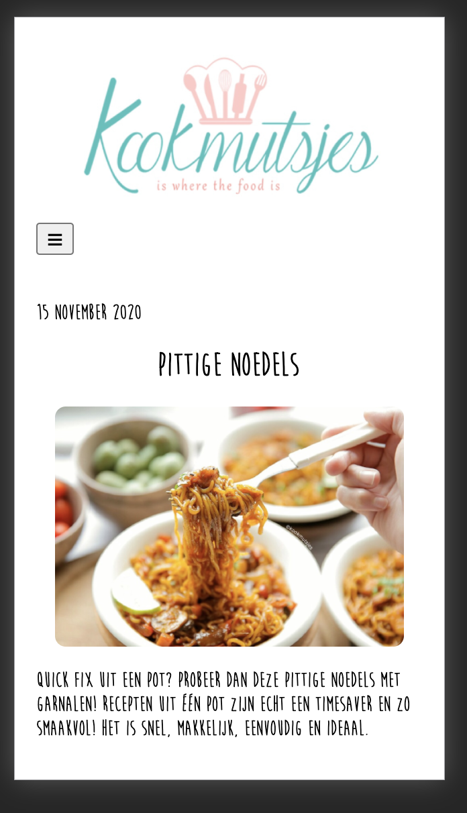
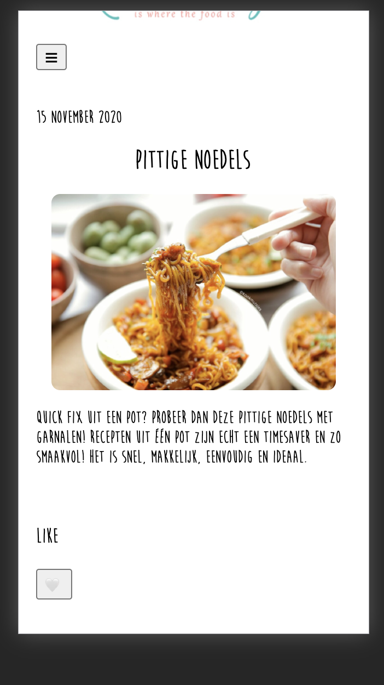
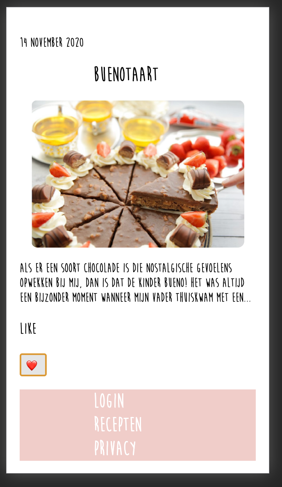
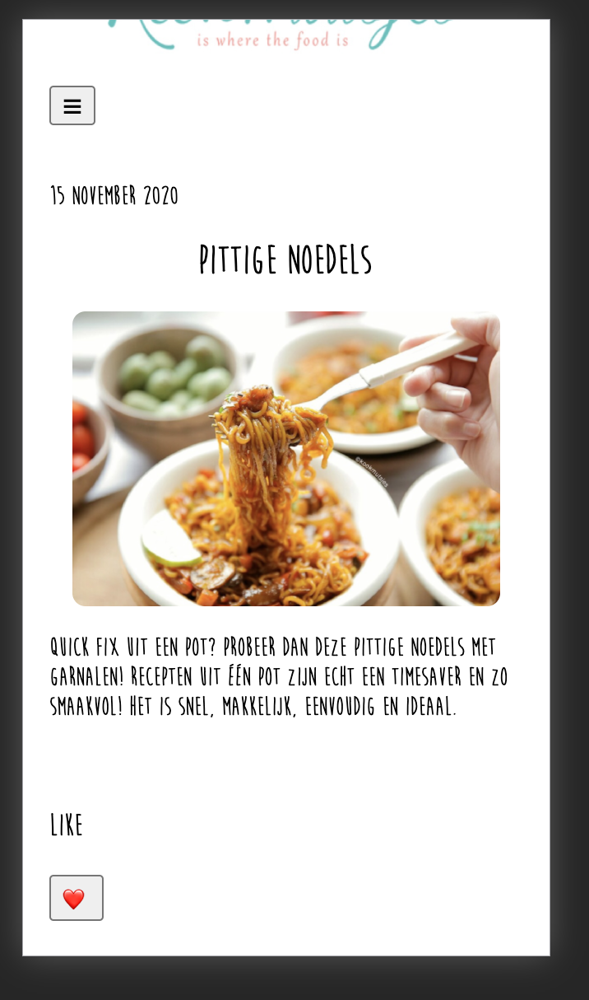
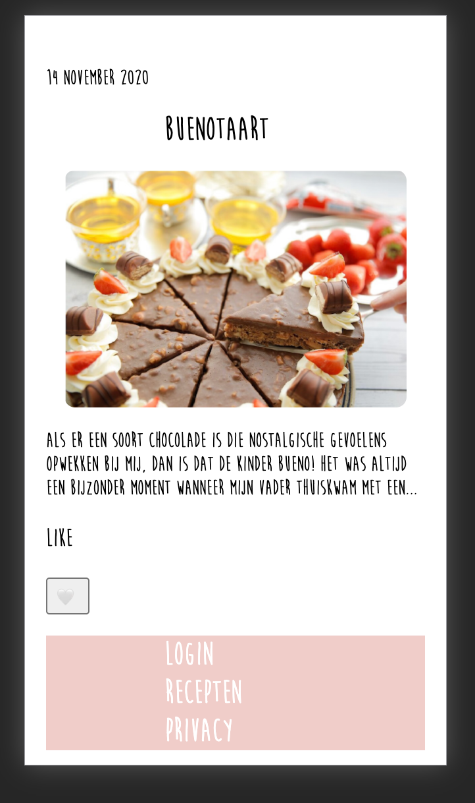

## Voortgang 2 (week 5)
Ik ben bezig geweest met mijn menu en like button werkend te krijgen.
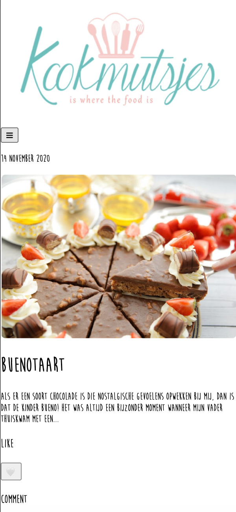
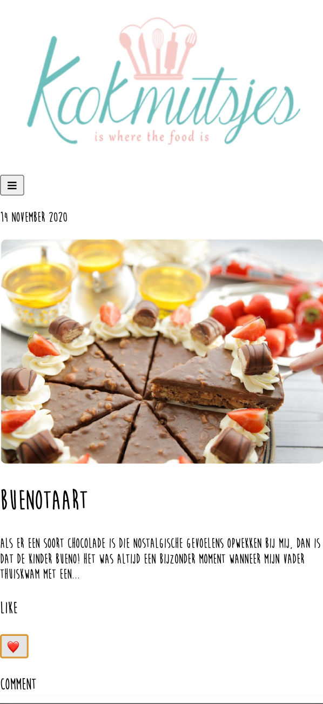
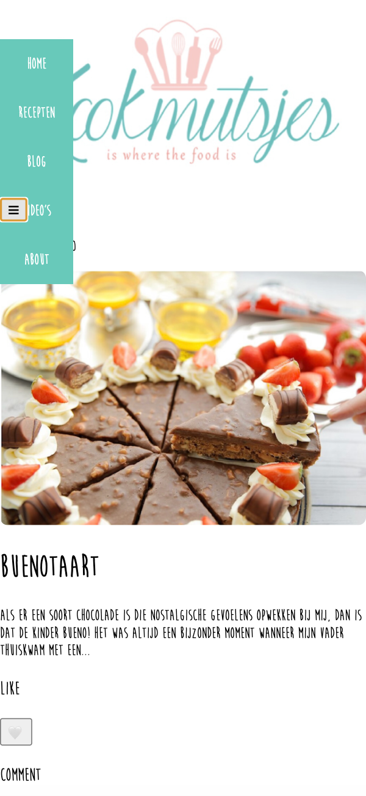

## Voortgang 1 (week 3)

### Stand van zaken

-Ik vond het best lastig om weer te wennen aan programmeren. Ik ben hier persoonlijk niet zo goed in. Het gaat voor nu wel oke.-

**Screenshot(s):**

-Ik ben nu bezig met mijn website en ben nog bezig met css-
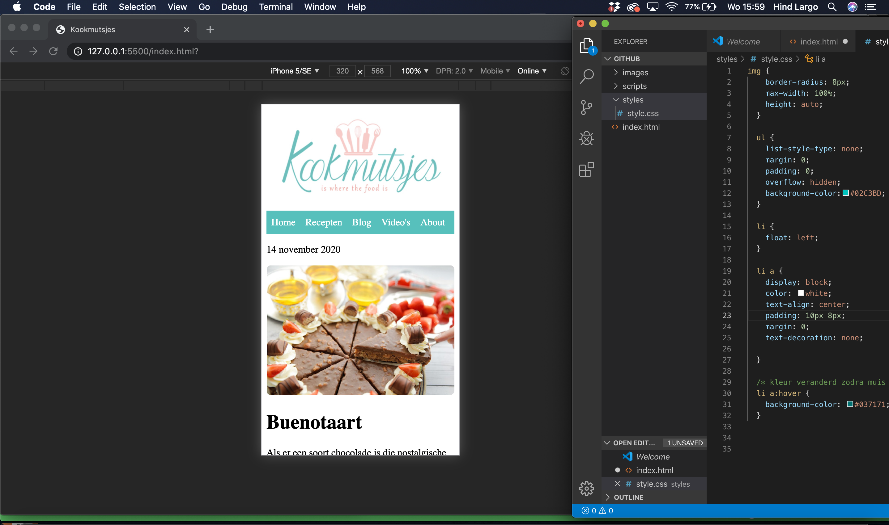
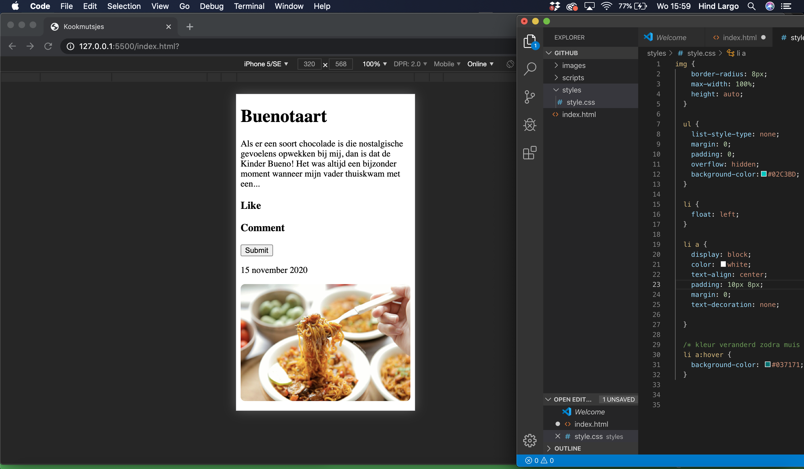
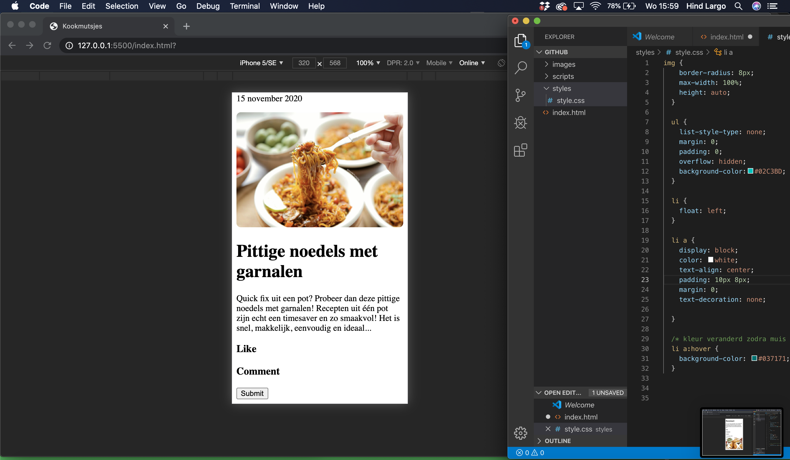

### Agenda voor meeting

-samen met je groepje opstellen-

| student 1      | student 2          | student 3    | student 4        |
| ---            | ---                | ---          | ---              |
| dit bespreken  | en dit             | en ik dit    | en dan ik dat    |
| an dat ook nog | dit als er tijd is | nog een punt | dit wil ik zeker |
| ...            | ...                | ...          | ...              |

### Verslag van meeting

-na afloop snel uitkomsten vastleggen-

## Breakdownschets (week 1)

-uitwerken voor de 1e werkgroep - eind van de eerste week-

## Intake (week 1)
-uitwerken voor de kick-off werkgroep - begin van de eerste week-

**Je startniveau:** Kies voor blauw-

**Je focus:** -kies uit responsive -

**Je opdracht:** -link naar de website die je gaat namaken-

**Screenshot(s) van de eerste pagina (small screen):**

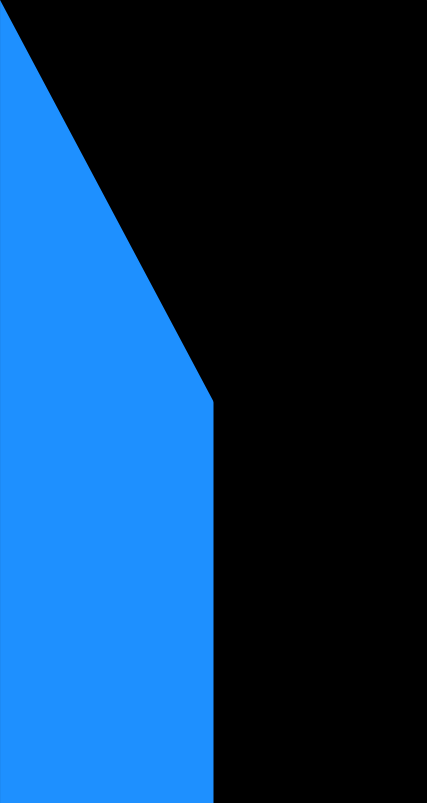

**Screenshot(s) van de tweede pagina (small screen):**

